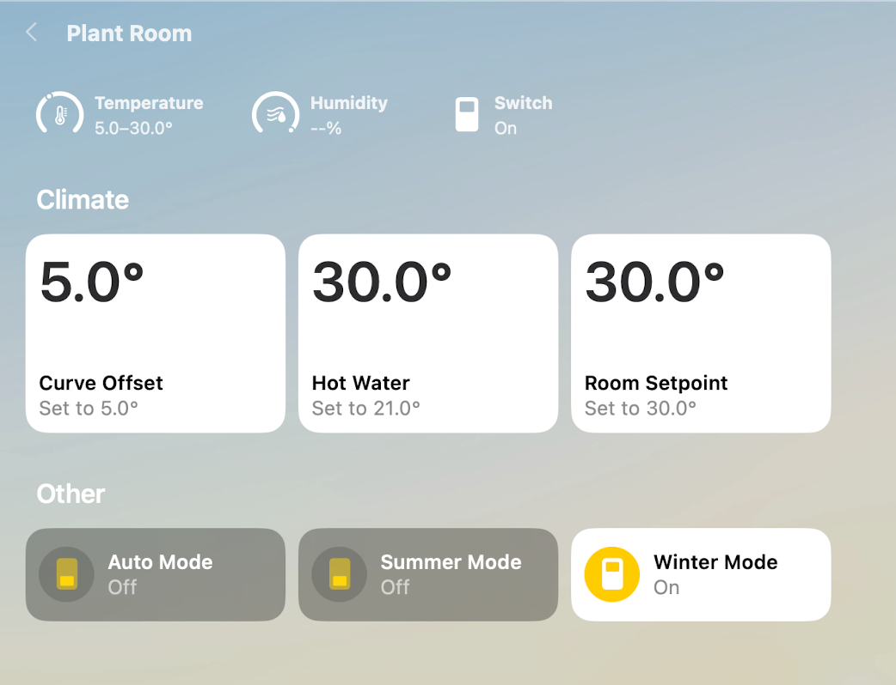

# Homebridge IES Heat Pump

A [Homebridge](https://homebridge.io) plugin for IES/Xterra heat pumps, allowing you to monitor and control your heat pump from Apple HomeKit.

## Features

- **Hot Water Control** - View current temperature and adjust the setpoint (5-70°C)
- **Curve Offset** - Adjust the heating curve offset (-10 to +10°C)
- **Room Setpoint** - Set the target room temperature (5-40°C)
- **Season Mode** - Switch between Summer, Winter, and Auto modes
- **Outdoor Temperature** - View outdoor temperature sensor reading

## Screenshots



## Installation

1. Install Homebridge (if not already installed)
2. Install this plugin:
   ```bash
   npm install -g homebridge-ies-heatpump
   ```
3. Configure the plugin (see Configuration below)

## Configuration

Add the following to your Homebridge `config.json`:

```json
{
  "platforms": [
    {
      "platform": "IESHeatPump",
      "name": "IES Heat Pump",
      "deviceId": "YOUR_DEVICE_ID",
      "username": "your@email.com",
      "password": "your_password",
      "pollingInterval": 60
    }
  ]
}
```

### Configuration Options

| Option | Required | Description |
|--------|----------|-------------|
| `platform` | Yes | Must be `IESHeatPump` |
| `name` | Yes | Display name for the platform |
| `deviceId` | Yes | Your IES device ID (found in the URL when viewing your device) |
| `username` | Yes | Your IES Heat Pumps account email |
| `password` | Yes | Your IES Heat Pumps account password |
| `pollingInterval` | No | Polling interval in seconds (default: 60, minimum: 30) |

### Getting Your Device ID

1. Log into the IES web portal
2. Navigate to your device
3. The device ID is in the URL, e.g., `https://www.ies-heatpumps.com/main/monitoring/999` → device ID is `999`

## HomeKit Accessories

This plugin creates the following accessories:

| Accessory | Type | Description |
|-----------|------|-------------|
| Hot Water | Thermostat | Current tank temperature and setpoint control |
| Curve Offset | Thermostat | Heating curve offset adjustment |
| Room Setpoint | Thermostat | Target room temperature |
| Summer Mode | Switch | Enable summer mode |
| Winter Mode | Switch | Enable winter mode |
| Auto Mode | Switch | Enable automatic season mode |
| Outdoor Temperature | Temperature Sensor | Outdoor temperature reading |

## Troubleshooting

### "Authentication failed" errors
Verify your username and password are correct. These are the same credentials you use to log into [ies-heatpumps.com](https://www.ies-heatpumps.com).

### Values not updating
Check that the polling interval is reasonable (60 seconds recommended). Changes made in HomeKit should reflect immediately.

### Accessories showing "No Response"
1. Verify your username and password are correct
2. Verify your device ID is correct
3. Check Homebridge logs for specific error messages

## Development

```bash
# Install dependencies
npm install

# Build
npm run build

# Lint
npm run lint

# Watch mode
npm run watch
```

## License

MIT

## Disclaimer

This plugin is not affiliated with or endorsed by IES. Use at your own risk.
